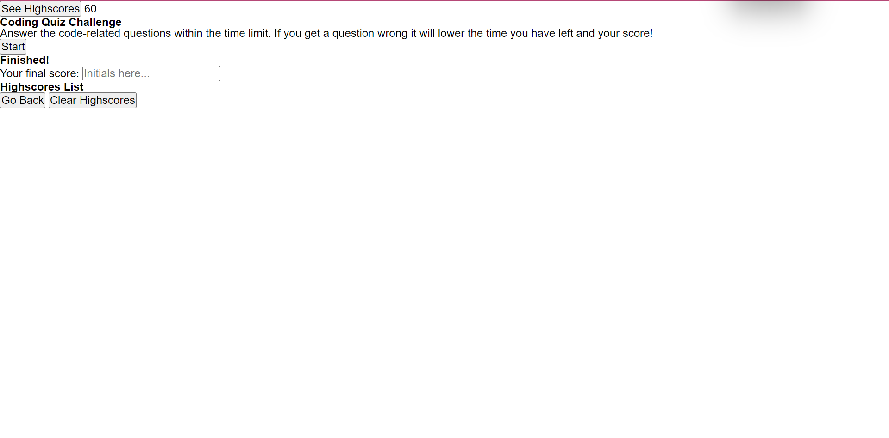

# FunkE Coding Quiz

## Description

This website is for beginner coders looking to test their knowledge. The quiz consists of 5 simple questions. The quiz is timed and will test you knowledge against the time and questions answered. I am motivated to help fellow coders quiz themselves for practice. I learned how to use javascript and used prior knowledge of css and html to create the web page.

## Table of Contents (Optional)

- [Installation](#installation)
- [Usage](#usage)
- [Credits](#credits)
- [License](#license)

## Installation

No installation needed. Is the URL link here -->

## Usage

    '''
 
 '''

## Credits

I worked closely Christina Feland, Joseph Rudasill and Tyreal 

- https://github.com/TheWiseSailor
- https://github.com/KCGSWAGG

## License

MIT License.

## Badges

none

## Features

none

## How to Contribute

none

## Tests

none